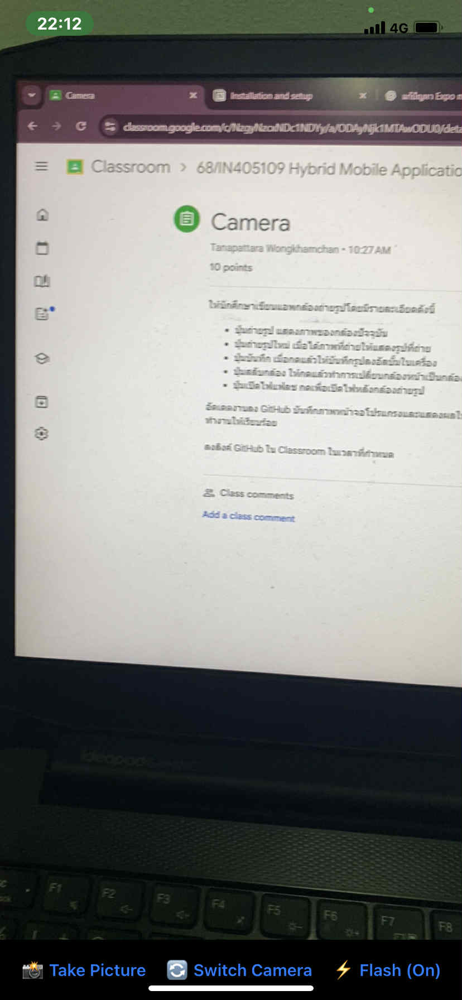

# camera-app
Camera | 10 points | 09/09/2568

รายละเอียดโปรแกรมและการทำงาน   
Take Picture - กดเพื่อถ่ายรูปภาพ   
Switch Camera - กลับกล้องหน้า - หลัง   
Flash (On/Off) - เปิดปิดแฟลชหลังกด Take Picture   
Retake - กดกลับไปหน้าหลักเพื่อถ่ายรูปใหม่  
  

การติดตั้ง   
- สร้างโปรเจคจาก expo และเปิดโค้ดพร้อมตั้งค่าเพิ่มเข้าไปในโค้ดต่อไปนี้   

#Topic -> "dependencies"   
package.json ->   
    "expo-camera": "~16.1.11",   
    "expo-media-library": "~17.1.7"   

#Topic -> "dependencies"   
package-lock.json   
    "expo-camera": "~16.1.11",   
    "expo-media-library": "~17.1.7",   

หลังจากติดตั้งเสร็จสร้าง App.tsx จากนั้นโค้คดสิ่งที่ต้องการลงไปในไฟล์นี้ได้เลย   
 
